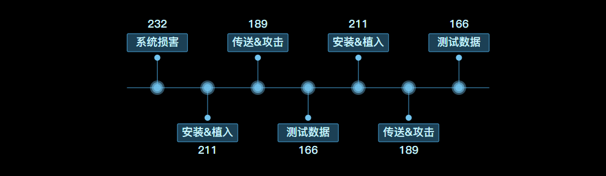
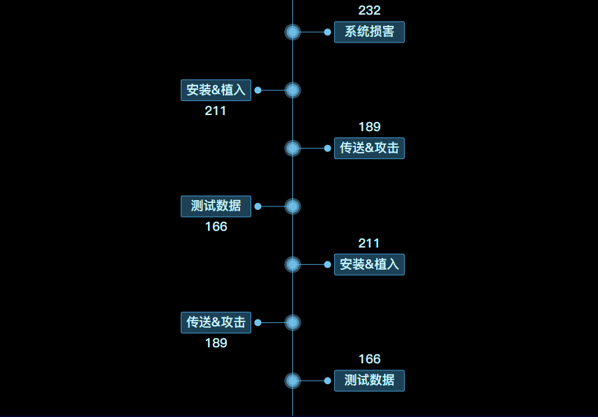

# v-svg-chain 用于svg链式数据展示


## v-svg-chain- 横向
>用于svg链式数据展示, 仅需传递 <code>data</code>即可。

```html
<template>
  <v-svg-chain @clickItem="testClick" style="height: 300px;" :data="originData" :style="{ backgroundColor: 'black' }"></v-svg-chain>
   <button @click="changeData">测试</button>
</template>
<script>
 const chainData = require('../../mock/kill-chain.json')
  export default {
    data () {
      return {
        originData:[
          {
            "key": "/System_Compromise",
            "name": "数据变更",
            "value": 232
          },
          {
            "key": "/Exploitation_Installation",
            "name": "安装&植入",
            "value": 211
          },
          {
            "key": "/Delivery_attack",
            "name": "传送&攻击",
            "value": 189
          },
          {
            "key": "/Delivery_attack1",
            "name": "测试数据",
            "value": 166
          },
          {
            "key": "/Exploitation_Installation",
            "name": "安装&植入",
            "value": 211
          },
          {
            "key": "/Delivery_attack",
            "name": "传送&攻击",
            "value": 189
          },
          {
            "key": "/Delivery_attack1",
            "name": "测试数据",
            "value": 166
          }
        ],
      }
    },
    methods: {
      testClick (value, index) {
        console.log('点击操作~~', value, index)
      },
      changeData () {
        this.originData[0].name = '数据变更'
        console.log(this.originData)
      }
    }
  }

</script>
```
**如下图:**



## 链式组件 - 纵向

 >需要指定需要指定`direction`为`vertical`
```html

<template>
  <v-svg-chain style="height: 600px;" :data="originData" :style="{ backgroundColor: 'black' }" direction="vertical"></v-svg-chain>
</template>
<script>
 const chainData = require('../../mock/kill-chain.json')
  export default {
    data () {
      return {
          originData:[
          {
            "key": "/System_Compromise",
            "name": "数据变更",
            "value": 232
          },
          {
            "key": "/Exploitation_Installation",
            "name": "安装&植入",
            "value": 211
          },
          {
            "key": "/Delivery_attack",
            "name": "传送&攻击",
            "value": 189
          },
          {
            "key": "/Delivery_attack1",
            "name": "测试数据",
            "value": 166
          },
          {
            "key": "/Exploitation_Installation",
            "name": "安装&植入",
            "value": 211
          },
          {
            "key": "/Delivery_attack",
            "name": "传送&攻击",
            "value": 189
          },
          {
            "key": "/Delivery_attack1",
            "name": "测试数据",
            "value": 166
          }
        ]
      }
    }
  }

</script>
```
**如下图:**



### Props

|参数|说明|类型|可选值|默认值|
|----|---|---|-----|-----|
| data| 攻击链数据 | `Array` | `必选` | --- |
| direction | 攻击链方向 | `String` | `horizontal/vertical` | `horizontal` |
| styleConfig | 样式配置项,`注意`: 外部传入值会与默认值进行`merge`操作 | `Object` | --- | `具体配置见下方styleConfig` |

### styleConfig
|参数|说明|类型|可选值|默认值|
|----|---|---|-----|-----|
| mediumLine| 中线样式 | `Object` | --- | `{ stroke: '#46A0D4',strokeWidth: 1 }` |
| nodeStartCircle | 节点起始端圆环样式 (中线上圆环) | `Object` | --- | `{ fill: '#72C4EF' }` |
| nodeLine | 节点分支线样式 | `Object` | --- | `{ stroke: '#46A0D4' }` |
| nodeEndCircle| 节点末端圆环样式 | `Object` | --- | `{ fill: '#72C4EF' }` |
| textContainer | 文本矩形矩形容器样式 | `Object` | --- | `{ width: '100', height: '30', fill: '#46A0D4', stroke: '#46A0D4',fillOpacity: 0.4, rx: 2 }` |
| text | 文本样式 | `Object` | --- | `{ fontSize: '18px', fontFamily: 'PingFangSC-Regular, PingFang SC', fontWeight: 'bold', fill: '#C9F6FF', textAnchor: 'middle', dominantBaseline: 'middle'}` |


### Events

| 事件名称 | 说明 | 回调参数 |
| -------- | ---- | -------- |
| clickItem | 点击攻击链具体节点触发 |  value, index |

### Slots

| name | 说明 |
| ---- | ---- |
| default | 节点起始端内容插槽, 当前默认为圆。 `注意`：该组件为svg书写, slot内容`仅支持`svg标签元素, 其他标签不会生效！|


